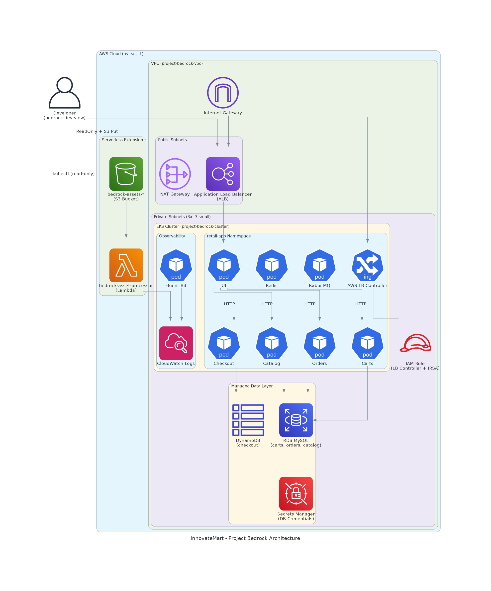

Here's a comprehensive README for Project Bedrock:

```markdown
# 🏗️ Project Bedrock - InnovateMart EKS Deployment

**Production-Grade Microservices on AWS EKS**



---

## 📋 Table of Contents

- [Overview](#overview)
- [Architecture](#architecture)
- [Prerequisites](#prerequisites)
- [Quick Start](#quick-start)
- [Infrastructure Details](#infrastructure-details)
- [Application Deployment](#application-deployment)
- [CI/CD Pipeline](#cicd-pipeline)
- [Security](#security)
- [Observability](#observability)
- [Serverless Extension](#serverless-extension)
- [Developer Access](#developer-access)
- [Cleanup](#cleanup)
- [Grading Deliverables](#grading-deliverables)

---

## Overview

**Company:** InnovateMart Inc.  
**Project:** Project Bedrock  
**Mission:** Deploy a production-grade microservices architecture on AWS EKS for the Retail Store application.

This project provisions a secure Amazon EKS cluster, deploys the AWS Retail Store Sample App, replaces in-cluster databases with managed AWS services (RDS MySQL, DynamoDB), implements CI/CD automation, and extends the architecture with serverless components.

### Key Features

- ✅ Infrastructure as Code (Terraform) with remote state management
- ✅ EKS cluster with managed node groups (t3.small instances)
- ✅ Managed databases (RDS MySQL, DynamoDB) replacing in-cluster databases
- ✅ Helm-based application deployment
- ✅ AWS Load Balancer Controller with ALB Ingress
- ✅ GitHub Actions CI/CD pipeline
- ✅ Developer IAM user with read-only access
- ✅ CloudWatch logging and observability
- ✅ Serverless Lambda function triggered by S3 uploads
- ✅ Security groups, Secrets Manager, and least-privilege IAM

---

## Architecture

```

Developer              │  ┌────────────────────────────────────┐  │
(bedrock-dev-view)     │  │  VPC (project-bedrock-vpc)         │  │
│                 │  │                                    │  │
▼                 │  │  Public Subnets                    │  │
┌─────────┐            │  │  ┌──────────┐  ┌──────────────┐   │  │
│  ALB    │◄───────────┼──┼──►  ALB     │  │  NAT Gateway │   │  │
└─────────┘            │  │  └──────────┘  └──────────────┘   │  │
│  │                                    │  │
│  │  Private Subnets (3 nodes)         │  │
│  │  ┌──────────────────────────────┐  │  │
│  │  │  EKS Cluster                 │  │  │
│  │  │  ┌────┐ ┌────┐ ┌─────────┐  │  │  │
│  │  │  │ UI │ │Cart│ │Catalog  │  │  │  │
│  │  │  └────┘ └────┘ └─────────┘  │  │  │
│  │  │  ┌────────┐ ┌──────────┐    │  │  │
│  │  │  │Orders  │ │Checkout  │    │  │  │
│  │  │  └────────┘ └──────────┘    │  │  │
│  │  └──────────────────────────────┘  │  │
│  │                                    │  │
│  │  ┌──────────────────────────────┐  │  │
│  │  │  Managed Data Layer          │  │  │
│  │  │  ┌─────────┐ ┌───────────┐  │  │  │
│  │  │  │RDS MySQL│ │ DynamoDB  │  │  │  │
│  │  │  └─────────┘ └───────────┘  │  │  │
│  │  └──────────────────────────────┘  │  │
│  └────────────────────────────────────┘  │
│                                          │
│  ┌────────────────────────────────────┐  │
│  │  Serverless Extension              │  │
│  │  ┌──────────┐    ┌──────────────┐ │  │
│  │  │ S3 Bucket│───►│   Lambda     │ │  │
│  │  │ (assets) │    │ (processor)  │ │  │
│  │  └──────────┘    └──────────────┘ │  │
│  └────────────────────────────────────┘  │
└─────────────────────────────────────────┘

```

---

## Prerequisites

- **AWS CLI** configured with admin credentials
- **Terraform** >= 1.5.0
- **kubectl** >= 1.28
- **Helm** >= 3.12
- **jq** (JSON processor)
- **GitHub account** with repository secrets configured

---

## Quick Start

### 1. Clone the Repository

```bash
git clone https://github.com/Tbraima44/PROJECT-BEDROCK.git
cd PROJECT-BEDROCK
```

2. Configure Database Password

```bash
chmod +x scripts/setup-credentials.sh
./scripts/setup-credentials.sh "YourSecurePassword123!"
```

Edit terraform/terraform.tfvars and set your student_id.

3. Create Remote State Bucket (if not exists)

```bash
aws s3api create-bucket \
  --bucket project-bedrock-tfstate-YOUR-STUDENT-ID \
  --region us-east-1
```

4. Deploy Infrastructure

```bash
cd terraform
terraform init
terraform plan -var="db_password=YourSecurePassword123!"
terraform apply -auto-approve -var="db_password=YourSecurePassword123!"
cd ..
```

5. Deploy Application

```bash
./scripts/deploy-app.sh
```

6. Access the Store

Get the ALB URL:

```bash
kubectl get ingress -n retail-app
```

Open the ADDRESS in your browser.

---

Infrastructure Details

VPC Configuration

Resource Details
VPC Name project-bedrock-vpc
CIDR 10.0.0.0/16
Public Subnets 2 (across AZs)
Private Subnets 2 (across AZs)
NAT Gateway 1

EKS Cluster

Resource Details
Cluster Name project-bedrock-cluster
Kubernetes Version 1.34
Instance Type t3.small (2 vCPU, 2 GiB)
Node Count 3 (max 5, min 2)
Pod Capacity ~33 pods (11 per node)

Managed Databases

Service Engine Endpoint Purpose
RDS MySQL MySQL 8.0 project-bedrock-mysql.*.rds.amazonaws.com Carts, Catalog, Orders
DynamoDB DynamoDB project-bedrock-retail-store Checkout

Other Resources

Resource Name
S3 Bucket bedrock-assets-YOUR-STUDENT-ID
Lambda bedrock-asset-processor
Secrets Manager project-bedrock-db-credentials
IAM User bedrock-dev-view

---

Application Deployment

Helm-Based Deployment (Bonus Objective)

The retail store application is deployed using the official Helm charts from the retail-store-sample-app repository.

Values file: kubernetes/helm/values.yaml

```yaml
mysql:
  enabled: false          # Disable in-cluster MySQL
dynamodb:
  enabled: false          # Disable in-cluster DynamoDB

carts:
  datasource:
    url: "jdbc:mysql://RDS_ENDPOINT:3306/retaildb"
    username: "admin"
    password: "YourSecurePassword123!"
# ... similar for catalog, orders, checkout
```

Single command deployment:

```bash
helm upgrade --install carts ./retail-store-sample-app/src/cart/chart/ \
  --namespace retail-app --values kubernetes/helm/values.yaml
```

All services (carts, catalog, orders, checkout, ui) are deployed with the same pattern.

Services

Service Database Helm Chart
UI N/A src/ui/chart/
Carts RDS MySQL src/cart/chart/
Catalog RDS MySQL src/catalog/chart/
Orders RDS MySQL src/orders/chart/
Checkout DynamoDB src/checkout/chart/
RabbitMQ In-cluster Built-in
Redis In-cluster Built-in

Ingress

An Application Load Balancer (ALB) is provisioned via the AWS Load Balancer Controller:

```bash
kubectl apply -f kubernetes/retail-store/ingress.yaml
```

---

CI/CD Pipeline

GitHub Actions Workflows

Workflow Trigger Action
Terraform Plan Pull Request to main (paths: terraform/**) Runs terraform plan, posts output as PR comment
Terraform Apply Push to main (paths: terraform/**) Runs terraform apply -auto-approve
Deploy Application Push to main (paths: kubernetes/**, lambda/**, scripts/**) or after Terraform Apply Runs deploy-app.sh

Required GitHub Secrets

Secret Description
AWS_ACCESS_KEY_ID AWS IAM user access key
AWS_SECRET_ACCESS_KEY AWS IAM user secret key
DB_PASSWORD Database password for RDS

---

Security

IAM

· EKS Cluster Role: AmazonEKSClusterPolicy, AmazonEKSVPCResourceController
· EKS Node Role: AmazonEKSWorkerNodePolicy, AmazonEKS_CNI_Policy, AmazonEC2ContainerRegistryReadOnly
· LB Controller Role: Custom inline policy with ELB, EC2, and IAM permissions (IRSA)
· Developer User (bedrock-dev-view): ReadOnlyAccess + s3:PutObject on assets bucket

Kubernetes RBAC

· Developer user mapped to view ClusterRole (read-only across all namespaces)
· AWS LB Controller has dedicated ClusterRole with ingress and target group binding permissions

Secrets Management

· Database credentials stored in AWS Secrets Manager
· Never hardcoded in source files committed to repository
· grading.json excluded from Git via .gitignore

Network Security

· RDS instances in private subnets
· Security groups restrict database access to EKS node/pod CIDR only
· ALB in public subnets with internet-facing scheme

---

Observability

CloudWatch Logs

· Control plane logs: API, Audit, Authenticator, ControllerManager, Scheduler
· Application logs: Fluent Bit DaemonSet ships container logs to CloudWatch
· Lambda logs: /aws/lambda/bedrock-asset-processor

View Logs

```bash
# Control plane logs
aws logs tail /aws/eks/project-bedrock-cluster/cluster --follow

# Application logs
aws logs tail /aws/containerinsights/project-bedrock-cluster/application --follow
```

---

Serverless Extension

S3 → Lambda Trigger

When a file is uploaded to bedrock-assets-YOUR-STUDENT-ID, the Lambda function bedrock-asset-processor is triggered.

Lambda code:

```python
def handler(event, context):
    bucket = event['Records'][0]['s3']['bucket']['name']
    key = event['Records'][0]['s3']['object']['key']
    print(f"Image received: {key}")
    return {'statusCode': 200, 'body': f'Successfully processed {key}'}
```

Test:

```bash
echo "test image" > test.jpg
aws s3 cp test.jpg s3://bedrock-assets-YOUR-STUDENT-ID/ --profile bedrock-dev
```

Check CloudWatch Logs for the Lambda function to see the log entry.

---

Developer Access

IAM User: bedrock-dev-view

Access Level Details
AWS Console ReadOnlyAccess managed policy
S3 s3:PutObject on bedrock-assets-* bucket
Kubernetes view ClusterRole (read-only)

Configure Developer Profile

```bash
aws configure --profile bedrock-dev
aws eks update-kubeconfig --name project-bedrock-cluster --profile bedrock-dev --region us-east-1

# Test read access
kubectl get pods -n retail-app          # ✅ Succeeds
kubectl delete pod <name> -n retail-app # ❌ Forbidden
```

---

Cleanup

Delete Application Resources

```bash
helm uninstall carts catalog orders checkout ui -n retail-app
kubectl delete namespace retail-app
```

Destroy Infrastructure

```bash
cd terraform
terraform destroy -auto-approve -var="db_password=YourSecurePassword123!"
cd ..
```

⚠️ Note: You may need to manually delete the ALB, release Elastic IPs, and delete network interfaces before Terraform destroy can complete. See troubleshooting section if destroy fails.

---

Grading Deliverables

Deliverable Status
Git Repository ✅ This repository
Architecture Diagram ✅ docs/architecture.png
Deployment Guide ✅ This README
Grading JSON ✅ grading.json (submitted separately)
Developer Credentials ✅ bedrock-dev-view IAM user
Resource Tagging ✅ All resources tagged Project: karatu-2025-capstone
Remote State ✅ S3 backend with encryption
CI/CD Pipeline ✅ GitHub Actions workflows
Helm Deployment ✅ kubernetes/helm/values.yaml

Generating grading.json

```bash
cd terraform
terraform output -json > ../grading.json
```

---

Troubleshooting

Terraform Destroy Fails

1. Delete the ALB manually:
   ```bash
   aws elbv2 delete-load-balancer --load-balancer-arn <ARN>
   ```
2. Release Elastic IPs:
   ```bash
   aws ec2 release-address --allocation-id <ALLOC_ID>
   ```
3. Delete network interfaces:
   ```bash
   aws ec2 delete-network-interface --network-interface-id <ENI_ID>
   ```
4. Retry destroy.

Pods CrashLoopBackOff

Check logs:

```bash
kubectl logs -n retail-app deployment/<service> --tail=50
```

Common issues:

· Wrong database credentials → Check Secrets Manager
· Missing MySQL driver → Use Helm charts instead of raw manifests
· Insufficient pod capacity → Increase node count

ALB Not Provisioning

Check LB controller logs:

```bash
kubectl logs -n kube-system deployment/aws-load-balancer-controller --tail=30
```

Common issues:

· Missing CRDs → Apply CRDs manually
· RBAC permissions → Update ClusterRole
· IAM policy missing actions → Update inline policy

---

Tags

All resources are tagged with:

```
Project: karatu-2025-capstone
```

---

License

This project is created for the Karatu 2025 Capstone program.

---

Contact

Student: [Your Name]
Repository: [GitHub URL]
Application URL: [ALB URL after deployment]

```

---
